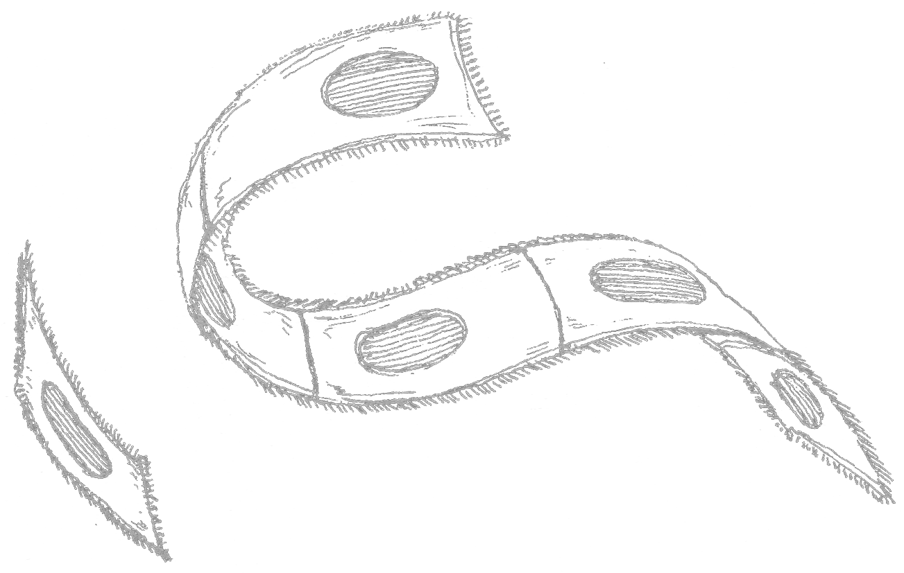

  <!--  -->
  

## Descripción
Una versión del "Game of Life" de John Horton Conway.    
Programado por Nicolás Donoso usando <a href='https://github.com/muinicomuiser/mui-js'>mui.js</a>  

Proyecto de estudio       
En proceso      

## Juego de la vida
Juego sin jugadores.      
Consta de una grilla con casillas que pueden ser ocupadas por una célula.     
La aparición o muerte de una célula en una casilla depende de la cantidad de células que haya alrededor.      
En cada turno nuevo se revisa la cantidad de vecinos de cada casilla para determinar su estado siguiente.     
Las reglas que definen si una célula nace, se mantiene viva o muere son las siguientes:     

Una célula nace si tiene exactamente tres células vecinas vivas (es decir, al turno siguiente estará viva).      
Una célula puede morir por dos causas:      
  -    Sobrepoblación: si tiene más de tres vecinos alrededor.     
  -    Aislamiento: si tiene solo un vecino alrededor o ninguno.  
    
Una célula se mantiene viva si tiene dos o tres vecinos a su alrededor.   

## Otros proyectos creados con mui.js
- <a href="https://muinicomuiser.github.io/boids" target="_blank">boids</a>
- <a href="https://muinicomuiser.github.io/Vida-y-particulas/" target="_blank">Vida y partículas</a>
- <a href="https://muinicomuiser.github.io/mui-js/" target="_blank">Figuras geométricas y colisiones</a>

 
